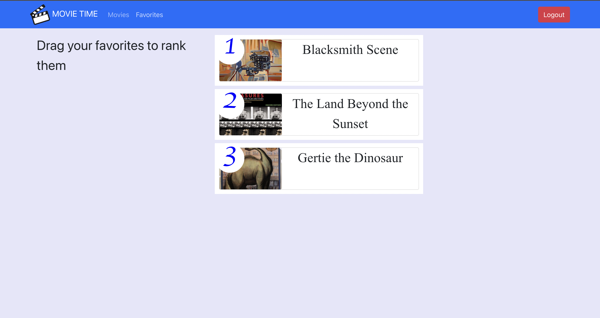

## **Movie Review Collection**
&emsp;

### **Description**

Movie Review Collection is a full-stack application using the MERN (MongoDB, Express, React, Node.js). The application offers the user a collection of movies, where they get to review the movies and read the review by other users. The user can also choose his favorites and rank his favorites.

&emsp;

### **Functionalities**

1. User can Login and logout using the Google Authentication system.
2. Once Logged in the user can select a movie a write a review or edit/delete an exisiting one. 
3. The user also can click on the stars that appear over the movie poster and make them their favorites. 
4. In the favorites page, they can use the drag and drop to rank their favorites. 

&emsp;

### **How to run the project**

1. Clone the repository. 
2. To run the backend change the directory to backend folder and execute the command 
````sh
node index.js
````
3. To run the frontend change the directory to frontend folder and execute the command 
````sh
npm start
````

### **User Interface of the Application**

&emsp;

### The landing page 

 

&emsp;

### The favorites on the movies

 

&emsp;


### Ranking the favorites

 