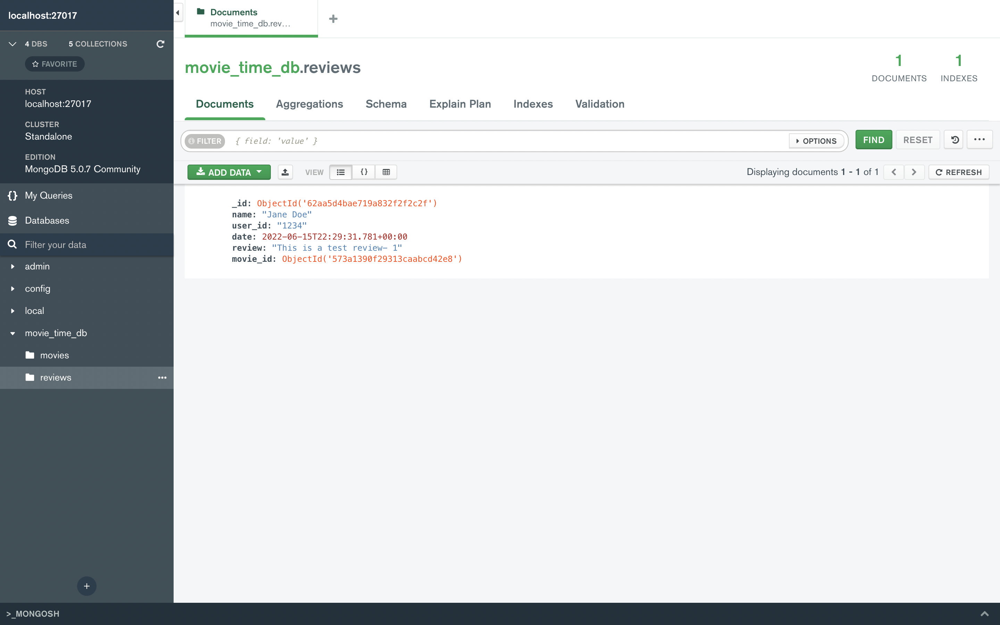
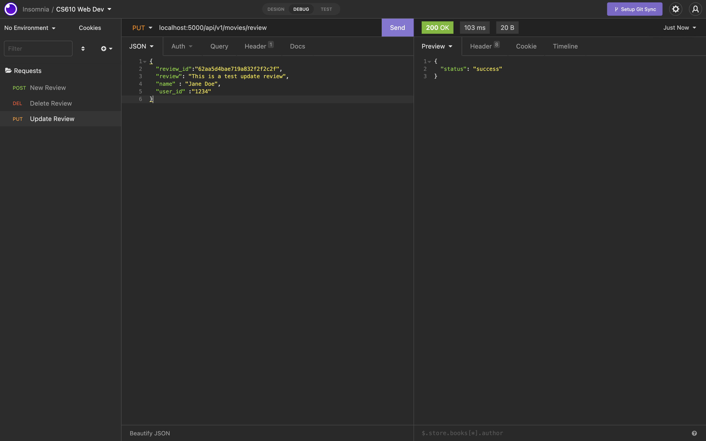
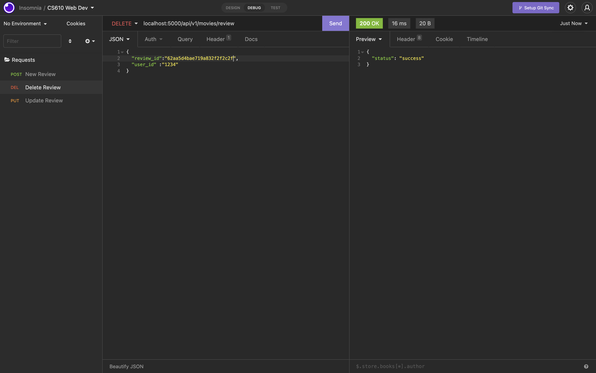
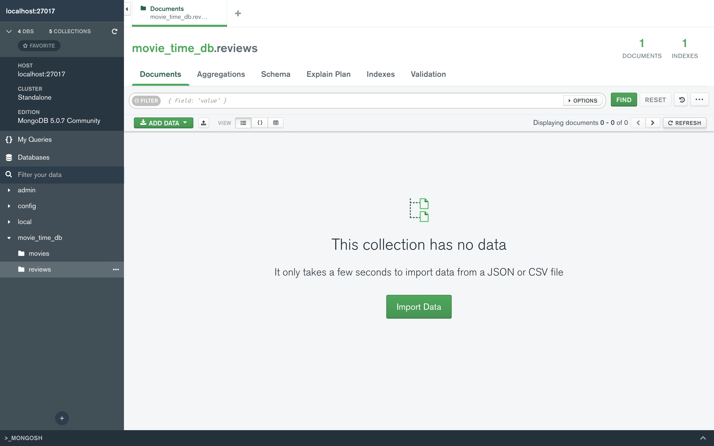
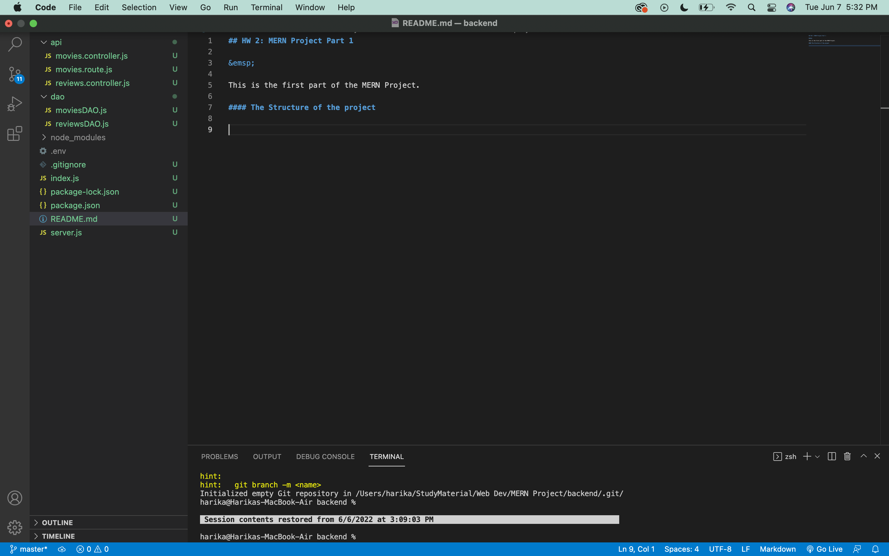
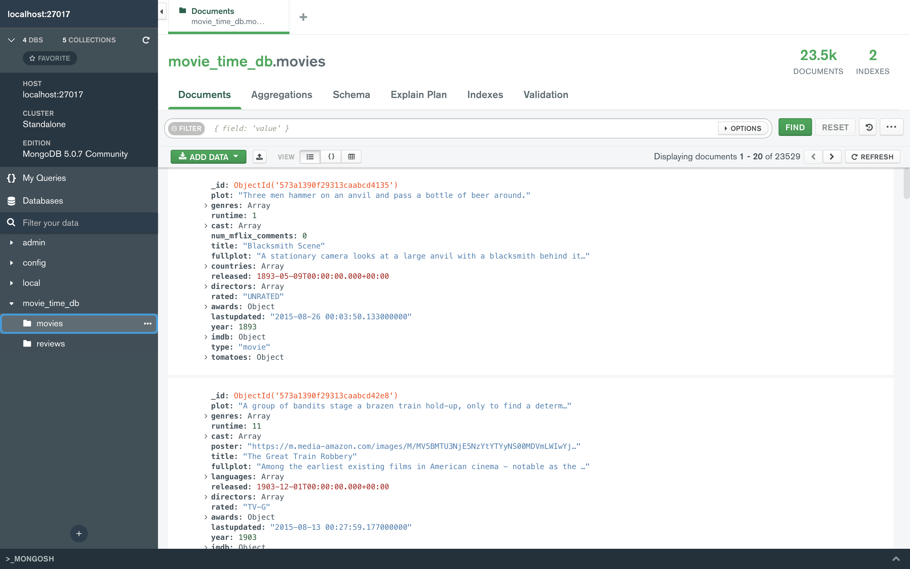

## HW 3: MERN Project Part 2

&emsp;

This is the second part of the MERN Project continuation to the previous one.

### Compass Interface
&emsp;

The following screenshot displays the details of the review added when the POST request is sent. 

### Insomnia Requests
&emsp;
#### PUT Request

The following screenshot displays the successful status of the PUT Request. We use the Review Id of the review created using the POST Request and update that review.

 

#### DELETE Request

The following screenshot displays the successful status of the DELETE Request. We use the Review Id of the review created using the POST Request and then delete that review using the DELETE Request.

 

Once the DELETE request has been made, refreshing the Database to see that review has been deleted.

 

## HW 2: MERN Project Part 1

&emsp;

This is the first part of the MERN Project. 

### The Structure of the project
&emsp;

The following screenshot displays the structure of the Backend. These are the required files for the project.

### MongoDB Compass Installation
&emsp;

The following screenshot displays the movie_time_db.movies collection in the local server.

 