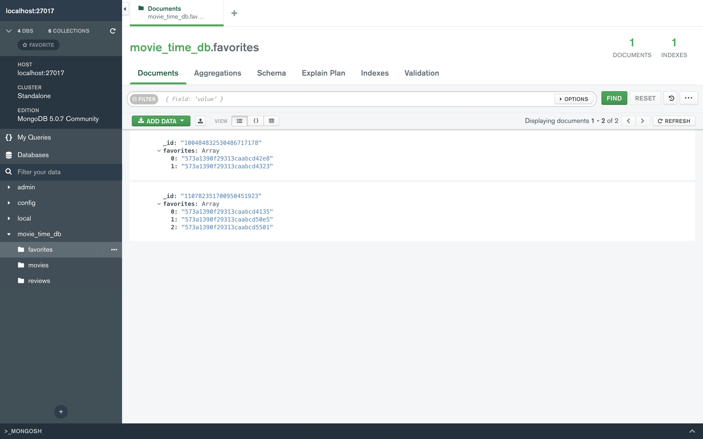
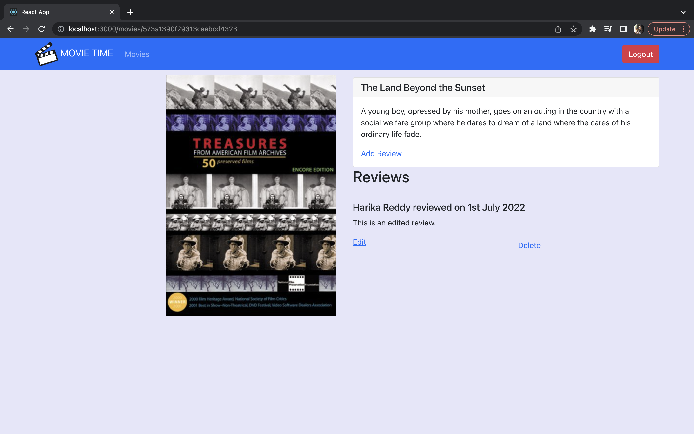
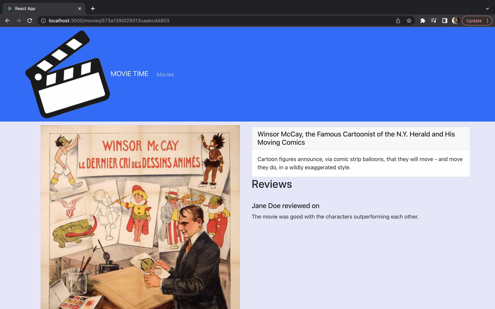
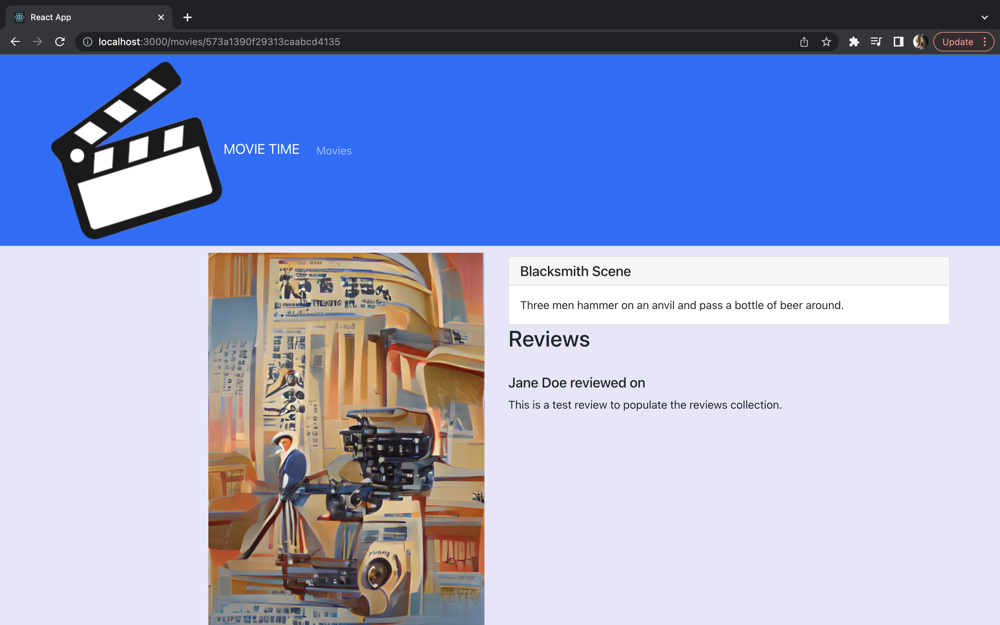
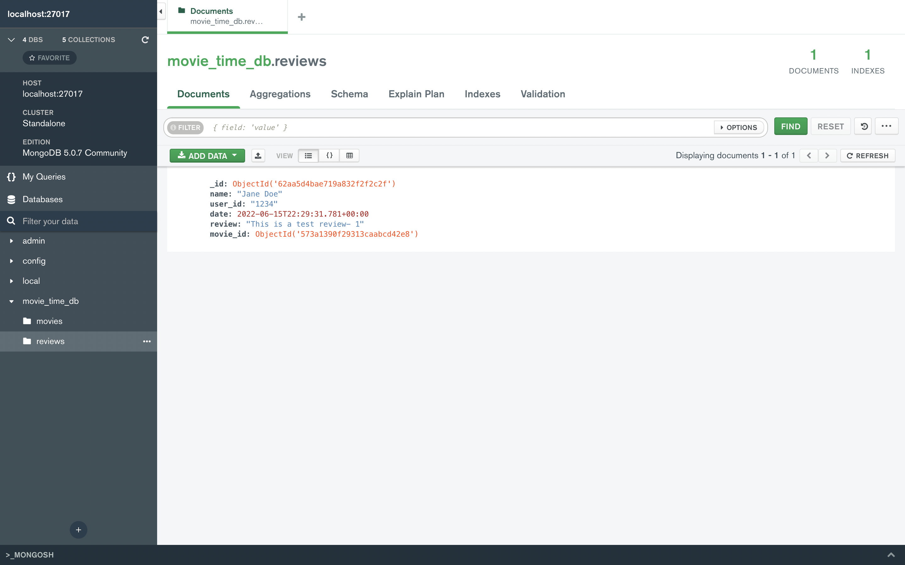
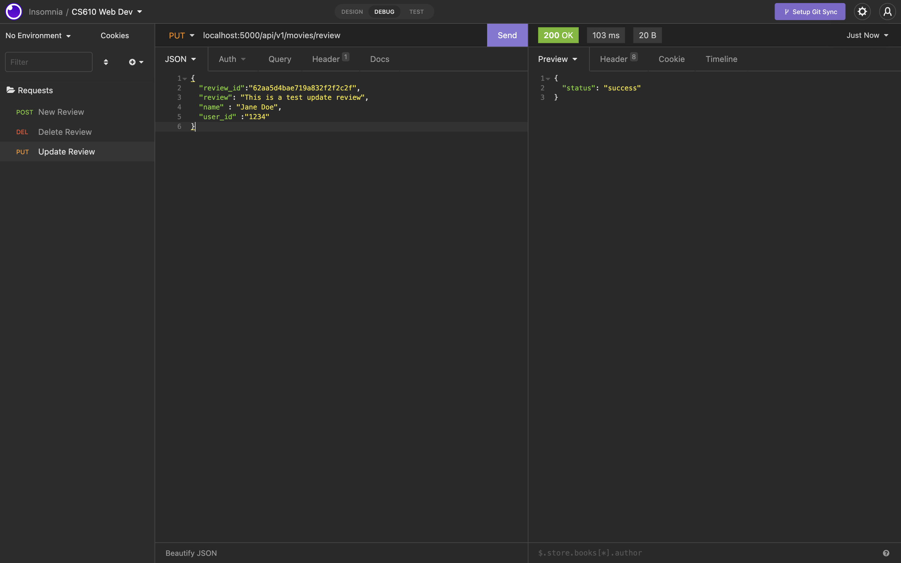
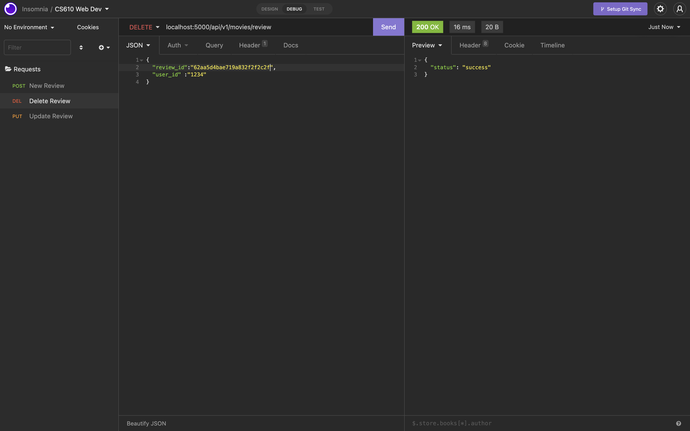
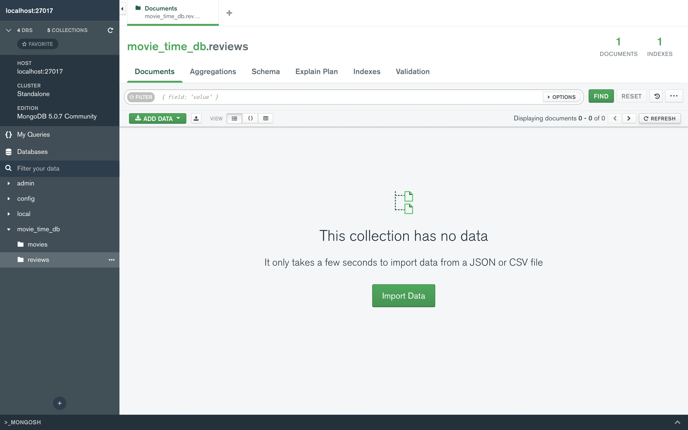
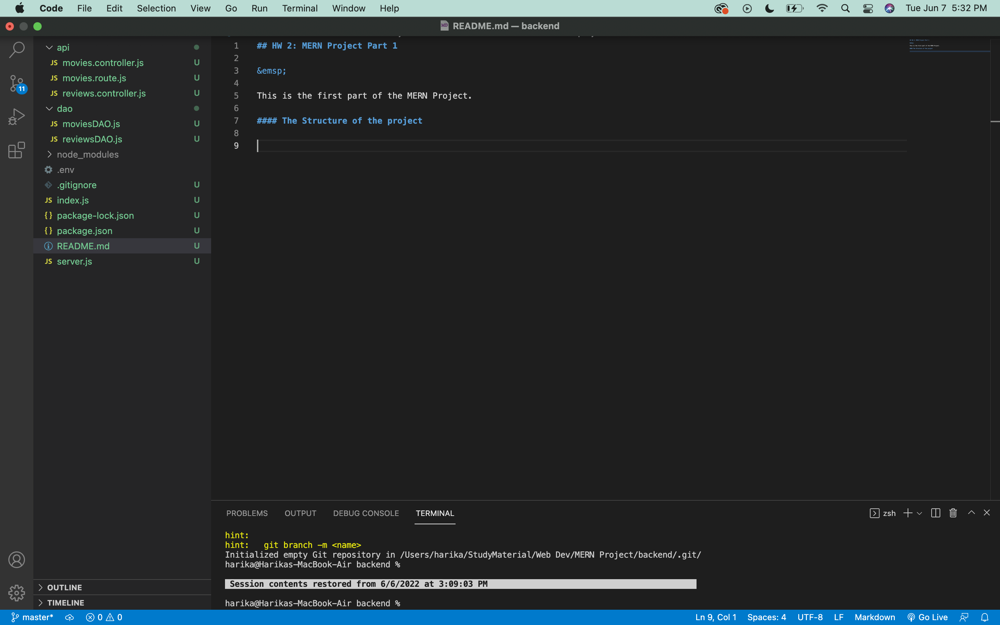
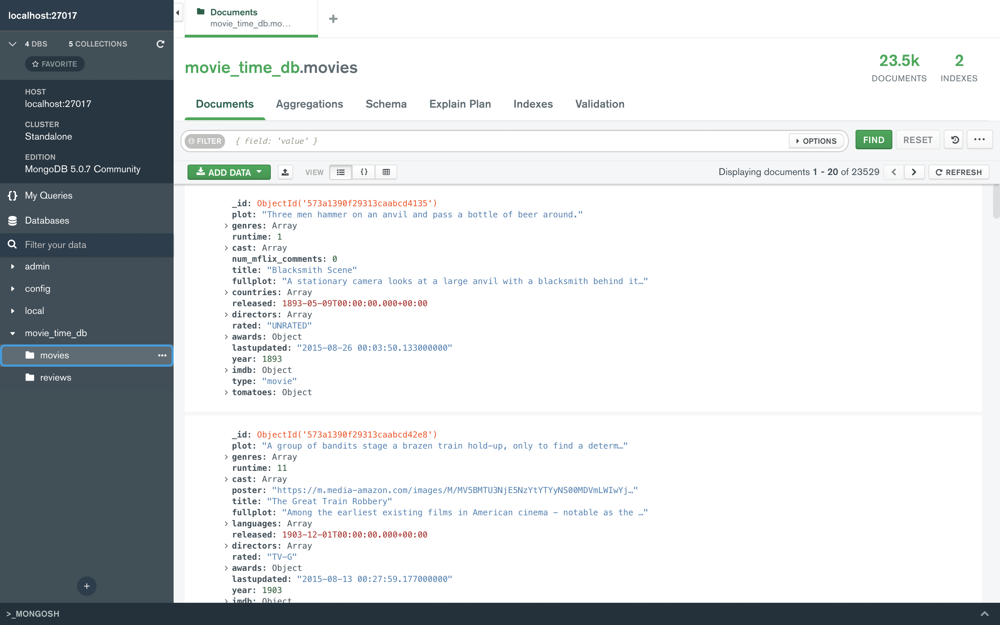

## **HW 6: MERN Project Part 5**
&emsp;

This is the fifth part of the MERN Project continuation to the previous one focused on implementing the favorites functionality. The user can add and remove favorites.

### **Screenshot of the top page with the favorites stars displayed**
&emsp;

Users selected favorite items:
&emsp;

### **A screenshot of the the favorites list database table displayed in MongoDB Compass**
&emsp;
The favorites collection in the database which gets updated based on user data and their choices of favorite movies.
&emsp;

## **HW 5: MERN Project Part 4**
&emsp;

This is the fourth part of the MERN Project continuation to the previous one focused on implementing the login and logout feature. The user can also add, edit and delete the reviews posted from their account.

### **Screenshot of Movie Reviews page with a newly written review**
&emsp;

A new review is being added to movie.
&emsp;

### **A screenshot of the same page with the review edited**
&emsp;
An existing review of a movie is being edited.
&emsp;

&emsp;

## **HW 4: MERN Project Part 3**

&emsp;

This is the third part of the MERN Project continuation to the previous one focused on the frontend of the application.

### **Application at localhost:3000**
&emsp;

The following screenshot displays the application running at localhost:3000 with more than one movies and also displays movies having the placeholder image.

### **Single Movie Page (Own Poster)**
&emsp;

The following screenshot displays the application rendering the single movie page where the movie has its own poster

### **Single Movie Page (Placeholder Poster)**
&emsp;

The following screenshot displays the application rendering the single movie page where the movie doesn't have an own poster and hence a placeholder poster is rendered in it's place.

## **HW 3: MERN Project Part 2**

&emsp;

This is the second part of the MERN Project continuation to the previous one.

### **Compass Interface**
&emsp;

The following screenshot displays the details of the review added when the POST request is sent. 

### **Insomnia Requests**
&emsp;
#### **PUT Request**

The following screenshot displays the successful status of the PUT Request. We use the Review Id of the review created using the POST Request and update that review.

 

#### **DELETE Request**

The following screenshot displays the successful status of the DELETE Request. We use the Review Id of the review created using the POST Request and then delete that review using the DELETE Request.

 

Once the DELETE request has been made, refreshing the Database to see that review has been deleted.

 

## HW 2: **MERN Project Part 1**

&emsp;

This is the first part of the MERN Project. 

### **The Structure of the project**
&emsp;

The following screenshot displays the structure of the Backend. These are the required files for the project.

### **MongoDB Compass Installation**

&emsp;

The following screenshot displays the movie_time_db.movies collection in the local server.

 